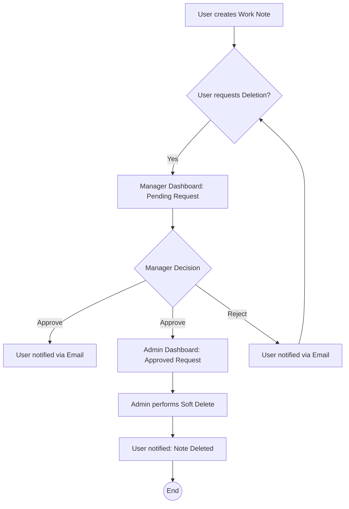

# Task Management & Note Workflow System

A robust Django-based task management application featuring Role-Based Access Control (RBAC) and a multi-stage approval workflow for document deletion.

## 🚀 Key Features

- **Multi-Role System**:
  - **User**: Create personal or work notes. Request deletion for work notes.
  - **Manager**: Review deletion requests. Approve or Reject requests from users.
  - **Admin**: Perform final soft-deletion of approved work notes.
- **Note Workflow**: Comprehensive pipeline for handling sensitive work data.
- **Email Notifications**: Automated email alerts via Gmail SMTP for approvals, rejections, and final deletions.
- **Secure Authentication**: Built-in signup/login with role assignment.
- **Production Ready**: Configured for Render and PythonAnywhere with WhiteNoise static serving.

## 📊 Application Flow Diagram

Below is the visualization of the Work Note Deletion Workflow:



## 🛠️ Tech Stack

- **Backend**: Django 5.2+
- **Database**: SQLite (configured for persistent storage)
- **Styling**: Pure HTML/CSS (Handwritten aesthetic)
- **Deployment**: Render, Gunicorn, WhiteNoise
- **Email**: SMTP (Gmail)

## ⚙️ Local Setup

1. **Clone the repository**:
   ```bash
   git clone <your-repo-url>
   cd task_management
   ```

2. **Create a Virtual Environment**:
   ```bash
   python -m venv venv
   source venv/bin/activate  # On Windows: venv\Scripts\activate
   ```

3. **Install Dependencies**:
   ```bash
   pip install -r requirements.txt
   ```

4. **Environment Variables**:
   Create a `.env` file in the root directory:
   ```env
   SECRET_KEY=your_secret_key
   DEBUG=True
   EMAIL_HOST_PASSWORD=your_gmail_app_password
   ```

5. **Run Migrations & Server**:
   ```bash
   python manage.py migrate
   python manage.py runserver
   ```

## 🌐 Deployment

For instructions on deploying to **Render** or **PythonAnywhere**, please refer to [DEPLOYMENT.md](./DEPLOYMENT.md).

---
*Created with ❤️ by Antigravity*
